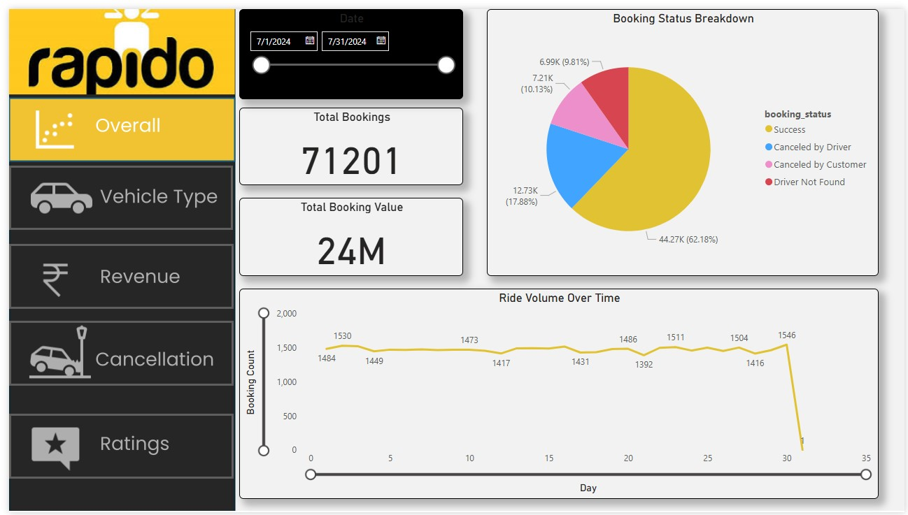

# 🧾 Rapido Booking Cancelation Analysis – Supply/Demand Forecasting

_Analyzing vendor efficiency and profitability to support strategic purchasing and inventory decisions using SQL, Excel, and Power BI._

---

## 📌 Table of Contents
- <a href="#overview">Overview</a>
- <a href="#business-problem">Business Problem</a>
- <a href="#dataset">Dataset</a>
- <a href="#tools--technologies">Tools & Technologies</a>
- <a href="#project-structure">Project Structure</a>
- <a href="#data-cleaning--preparation">Data Cleaning & Preparation</a>
- <a href="#exploratory-data-analysis-eda">Exploratory Data Analysis (EDA)</a>
- <a href="#research-questions--key-findings">Research Questions & Key Findings</a>
- <a href="#dashboard">Dashboard</a>
- <a href="#how-to-run-this-project">How to Run This Project</a>
- <a href="#final-recommendations">Final Recommendations</a>
- <a href="#author--contact">Author & Contact</a>

---
<h2><a class="anchor" id="overview"></a>Overview</h2>

This project analyzes **Rapido bookings and cancellations** data to uncover patterns, reasons for cancellations, and insights into ride trends.  
The analysis was performed using **SQL (PostgreSQL)** for data cleaning & queries and **Power BI** for visualization.

---
<h2><a class="anchor" id="business-problem"></a>Business Problem</h2>

Rapido, a bike-taxi platform, faces challenges with **high booking cancellations**.  
Cancellations negatively impact:
- 🚨 Customer experience (frustration due to unfulfilled rides)  
- 🚨 Driver efficiency (wasted time & resources)  
- 🚨 Company revenue (lost commission per ride)  

📌 **Objective:**  
Analyze booking and cancellation data to identify **patterns, root causes, and improvement opportunities** for reducing cancellations and improving operational efficiency.

---
<h2><a class="anchor" id="dataset"></a>Dataset</h2>

- Original dataset size: ~14 MB.
- The **dataset** is provided in `data/rapido_bookings.csv`.  
- Summary table created from ingested data and used for analysis.


🧾 Columns:
- **Date:** TIMESTAMP 

- **time:** TIME

- **booking_id:** TEXT

- **booking_status:** TEXT (Success, Canceled by Driver, Canceled by Customer, Driver not Found, etc.)

- **customer_id:** TEXT

- **vehicle_type:** TEXT (Prime Sedan, Prime SUV, Auto, Bike, etc.)

- **pickup_location:** TEXT

- **drop_location:** TEXT

- **v_tat:** INT

- **c_tat:** INT

- **canceled_rides_by_customer:** TEXT

- **canceled_rides_by_driver:** TEXT 

- **incomplete_rides:** BOOLEAN

- **incomplete_rides_reason:** TEXT

- **booking_value:** INT

- **payment_method:** TEXT (Cash, UPI, etc.)

- **ride_distance:** INT 

- **driver_ratings:** NUMERIC

- **customer_rating:** NUMERIC

- **vehicle_images:** TEXT


---

<h2><a class="anchor" id="tools--technologies"></a>Tools & Technologies</h2>

- PostgreSQL 
- Power BI (Interactive Visualizations)
- Excle
- GitHub

---
<h2><a class="anchor" id="project-structure"></a>Project Structure</h2>

```
Rapido-Booking-Cancelation-Analysis/
│
├── data/ #  dataset
│ └── rapido_bookings.csv
│
├── sql/ # SQL queries for analysis
│ └── rapido_kpi_SQL_data_analysis.sql
│
├── dashboard/ # Power BI dashboard file
│ └── rapido_dashboard.pbix
│
├── reports/ # Business Q&A Report
│ └── QnA_Report.pdf
│
├── output/ # Screenshots and visuals
│ └── Overall_preview.jpg
│ └── Vehicle_type_preview.jpg
│ └── Revenue_preview.jpg
│ └── Cancellation_preview.jpg
│ └── Ratings_preview.jpg
│
│
│
└── README.md # Project overview
```

---
<h2><a class="anchor" id="data-cleaning--preparation"></a>Data Cleaning & Preparation (SQL)</h2>

- Removed duplicates & null values.  
- Standardized booking status categories (`Completed`, `Canceled by Driver`, `Canceled by Customer`).  
- Created calculated fields for cancellation analysis.  

---
<h2><a class="anchor" id="exploratory-data-analysis-eda"></a>Exploratory Data Analysis (EDA)</h2>

Here are some highlights:

- ❓ **What percentage of bookings were cancelled?**  
  → **28.01% cancellations** overall (Either canceled by driver or canceled by customer).  

- ❓ **Cancellations happen because of Driver Not Found?**  
  → 9.81% total rides canceled because of driver not found.   

- ❓ **Completion Rate?**  
  → ~62.18% rides completed successfully.  


---
<h2><a class="anchor" id="research-questions--key-findings"></a>Research Questions & Key Findings</h2>

1. **Get the total number of cancelled rides by Drivers**: Total 12728 rides canceled by drivers. Which is 47.26% of total ride canceled in a month (The number is around double than the rides canceled by customer, which is 26.79% of total cancellation were happened).
2. **Top Vehicle type by total booking value**: Bike is top vehicle by total booking value.

---

<h2><a class="anchor" id="dashboard"></a>Dashboard</h2>

- Power BI Dashboard shows:
  - Ride Volume Over Time
  - Top 5 Vehicle Types by Ride Distance
  - Revenue by Payment Method
  - Top 5 Customers by Total Booking Value
  - Cancelled Rides Reasons (Customer)
  - cancelled Rides Reasons(Drivers)



---
<h2><a class="anchor" id="how-to-run-this-project"></a>How to Run This Project</h2>

1. Clone the repository:
```bash
git clone https://github.com/yourusername/rapido-bookings-cancellation-analysis-sql-powerbi.git
```
2. Open and run sql queries:
   - `rapido_kpi_SQL_data_analysis`
   
3. Open Power BI Dashboard:
   - `dashboard/rapido_dashboard.pbix`


---
<h2><a class="anchor" id="author--contact"></a>Author & Contact</h2>

**Amit Das**  
Data Analyst  
📧 Email: amit18das32@gmail.com  
🔗 [LinkedIn](https://www.linkedin.com/in/amit-das-0bb800158)  
